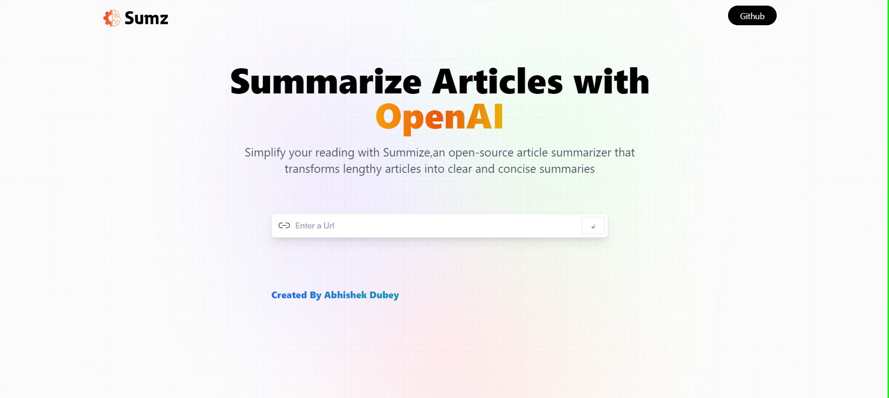
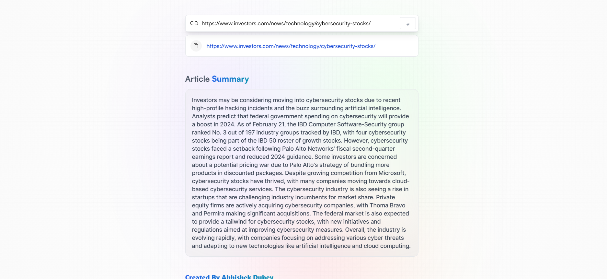
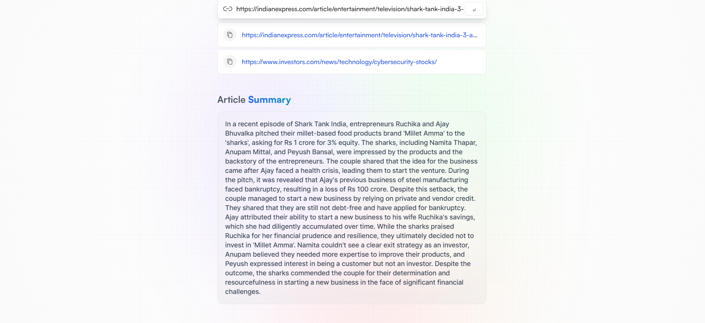

<h1 align="center" id="title">Ai-Summariser</h1>

<p align="center"></p>

<h2>🚀 Demo</h2>

[https://ai-summarizer-byad.netlify.app/](https://ai-summarizer-byad.netlify.app/)

<h2>Project Screenshots:</h2>


<p>The home page of the website</p>


<p>Getting the summary of the website,just by passing the URL of the website</p>


<p>The previously fetched summaries are also being stored with the URL of the website using the local storage of the system</p>

<h2>🛠️ Installation Steps:</h2>

<p>1. Clone the repository</p>

```
git clone https://github.com/AbhiD1678/Ai-Summary.git
```

<p>2. Navigate to the project directory:</p>

```
cd ai-summariser
```

<p>3. Install dependencies:</p>

```
npm install
```

<p>4. Start the development server:</p>

```
npm start
```
<p>PS: Add your API key before running the application</p>

  
  
<h2>💻 Built with</h2>

Technologies used in the project:

*   React
*   Redux
*   Tailwind Css
*   Axios

<h2>🛡️ License:</h2>

This project is licensed under the MIT License
